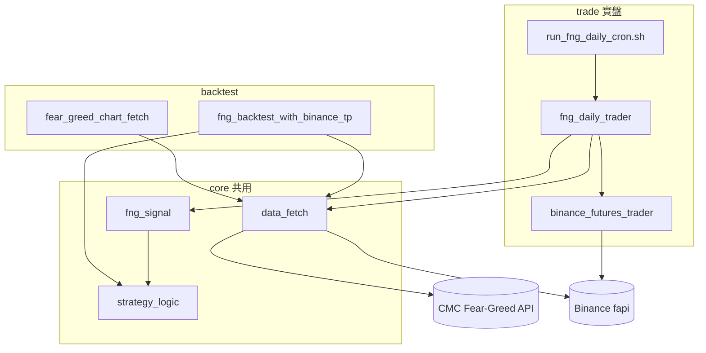
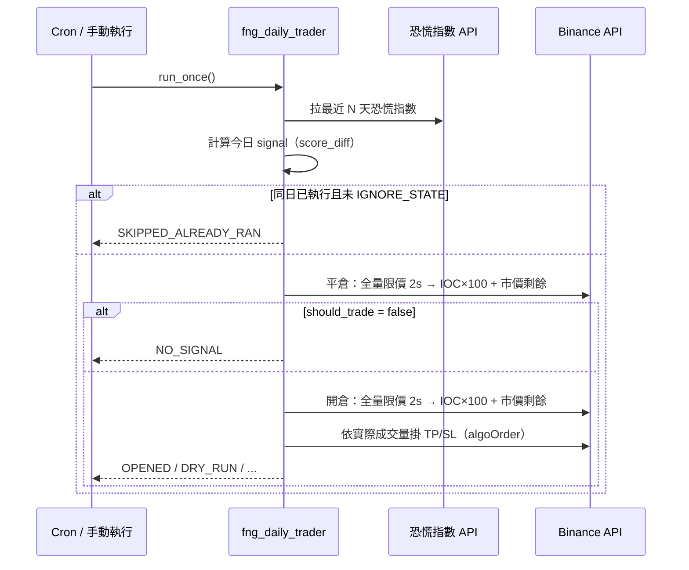

# fng_trading — Fear & Greed 量化策略

以 **CoinMarketCap 恐慌與貪婪指數（Fear & Greed）** 為訊號來源、**Binance USD-M 永續合約（BTCUSDT 日線）** 為執行標的的策略套件。  
同一套進場規則同時服務 **歷史回測** 與 **每日實盤排程**。

---

## 目錄

1. [專案結構](#專案結構)
2. [策略邏輯](#策略邏輯)
3. [資料來源](#資料來源)
4. [模組說明](#模組說明)
5. [實盤每日流程](#實盤每日流程)
6. [IOC 開／平倉機制](#ioc-開平倉機制)
7. [回測流程](#回測流程)
8. [環境變數](#環境變數)
9. [執行方式](#執行方式)
10. [排程（Cron）](#排程cron)
11. [執行紀錄與狀態檔](#執行紀錄與狀態檔)
12. [輸出 JSON 欄位說明](#輸出-json-欄位說明)
13. [依賴與前置條件](#依賴與前置條件)
14. [常見問題](#常見問題)
15. [舊路徑遷移](#舊路徑遷移)

---

## 專案結構

```
fng_trading/
├── README.md                 # 本文件
├── __init__.py
├── env_loader.py             # 載入 fng_trading/.env 與 dashboard/.env
├── core/                     # 回測與實盤共用
│   ├── data_fetch.py         # CMC 恐慌指數、Binance 日 K 線
│   ├── strategy_logic.py     # 進場規則、MA 調整 TP、回測 PnL／止盈止損模擬
│   └── fng_signal.py         # 實盤單日訊號（DailySignal）
├── backtest/                 # 歷史回測
│   ├── fear_greed_chart_fetch.py
│   ├── fng_backtest_with_binance_tp.py
│   └── test_data/            # 樣本資料與回測輸出
└── trade/                    # 實盤
    ├── binance_futures_trader.py   # Binance 合約 API（純 requests）
    ├── fng_daily_trader.py         # 每日主程式
    ├── run_logging.py              # jsonl / 終端摘要與帳戶快照
    ├── run_fng_daily_cron.sh       # Cron 包裝腳本
    └── runtime/                    # 狀態、日誌（執行時產生）
        ├── fng_daily_state.json
        ├── fng_daily_runs.jsonl
        └── fng_cron.log
```

**執行時工作目錄**：請在專案根目錄 `dashboard/` 下執行，以便 `python -m fng_trading...` 正確解析套件。



---

## 策略邏輯

### 訊號定義

每日使用恐慌指數 **當日分數 − 前一日分數** 作為 `score_diff`，再依區間決定方向與倉位類型。

| score_diff 區間 | 方向 | 策略數量 qty_btc | position_type |
|-----------------|------|------------------|---------------|
| `4 ~ 10` | LONG | 3 | 3 |
| `10 ~ 16` | LONG | 3 | 3 |
| `-20 ~ -4` | SHORT | 3 | 3 |
| `< -20` | SHORT | 3 | 3 |
| 其他 | 不交易 | 0 | — |

實作位置：`core/strategy_logic.py` → `get_position()`。

### 止盈／止損（回測與實盤定價基礎）

| position_type | 預設止盈率 | 預設止損率 |
|---------------|------------|------------|
| 1 / 2 / 3 | 4% | 6% |
| 4 | 2% | 6% |

### MA 調整止盈（可開關 `FNG_USE_MA_TP`）

使用進場日前 **90 根日 K** 收盤均線（回測 `apply_trade_logic` 固定 90 日；實盤由 `FNG_MA_DAYS` 控制，預設 90）。

- 進場價 **低於** MA → `ma_signal = 1`  
  - LONG：止盈率改為 **6%**
- 進場價 **高於** MA → `ma_signal = 0`  
  - SHORT：止盈率改為 **3%**

### 回測出場優先順序（`apply_trade_logic`）

持倉區間為進場日 K 線至下一根日 K 線（不含下一根開盤），在區間內用 high/low 判斷：

1. 若止盈與止損同時觸及 → **止損優先**（保守）
2. 否則若觸及止盈 → 止盈出場
3. 否則若觸及止損 → 止損出場
4. 否則 → **隔日收盤價** 正常平倉（`normal_exit`）

手續費：`FEE_RATE = 0.0003`（0.03%），進出各計一次。

---

## 資料來源

| 用途 | API | 模組 |
|------|-----|------|
| 恐慌指數 | `https://api.coinmarketcap.com/data-api/v3/fear-greed/chart` | `core/data_fetch.py` |
| 日 K 線 | `https://fapi.binance.com/fapi/v1/klines` | `core/data_fetch.py` |
| 實盤下單／持倉 | `https://fapi.binance.com`（簽名） | `trade/binance_futures_trader.py` |

恐慌指數每筆欄位：`score`、`timestamp`（Unix 秒）、`btcPrice` 等。

---

## 模組說明

### `core/data_fetch.py`

- `fetch_fear_greed_chart(start, end, convert_id)` — 拉 CMC 圖表 JSON  
- `load_fear_greed_from_file(path)` — 讀本地 `fear_greed_chart.json`  
- `fetch_binance_futures_klines(symbol, interval, start_ms, end_ms)` — 分頁拉 Binance 日線  

### `core/strategy_logic.py`

- `get_position(score_diff)` — 進場三元組 `(side, qty_btc, position_type)`  
- `get_take_profit_rate` / `get_stop_loss_rate`  
- `get_ma_signal_at` — MA 與調整後止盈率  
- `apply_trade_logic` — **僅回測用**，逐筆模擬持倉期間 TP/SL/隔日平倉  

### `core/fng_signal.py`

- `evaluate_latest_signal` — 實盤：最新一筆 vs 前一筆  
- `evaluate_signal_on_date` — 測試：指定 `YYYY-MM-DD` 當天 vs 前一筆  
- 回傳 `DailySignal` dataclass（含 `should_trade`、理論 TP/SL 價等）  

### `backtest/fear_greed_chart_fetch.py`

CLI 抓取恐慌指數並寫入 JSON（預設 `backtest/test_data/fear_greed_chart.json`）。

### `backtest/fng_backtest_with_binance_tp.py`

讀本地恐慌指數 → 建倉表 → 拉 Binance K 線 → `apply_trade_logic` → 輸出 JSON 與圖表。

### `trade/binance_futures_trader.py`

Binance USD-M 合約封裝（**僅 `requests` + HMAC**，無 `python-binance`）：

- 餘額：`GET /fapi/v2/balance`  
- 持倉：`GET /fapi/v2/positionRisk`  
- 一般下單（限價／IOC／市價）：`POST /fapi/v1/order`  
- 條件單 TP/SL：`POST /fapi/v1/algoOrder`（`algoType=CONDITIONAL`）  
- 撤一般掛單：`DELETE /fapi/v1/allOpenOrders`  
- 撤 Algo TP/SL：`DELETE /fapi/v1/algoOpenOrders`  
- 查 Algo 掛單：`GET /fapi/v1/openAlgoOrders`  
- 對手盤第一檔：`GET /fapi/v1/ticker/bookTicker`  
- **開／平倉執行**：`adjust_position_with_ioc_then_market`（限價 2s → IOC → 市價）  
- 開倉 + 掛 TP/SL：`open_position_with_brackets`  

### `trade/fng_daily_trader.py`

每日一次完整流程（見下節）。  

### `env_loader.py`

依序載入：

1. `fng_trading/.env`  
2. `dashboard/.env`  

無 `python-dotenv` 時會用手動解析 `.env`。

---

## 實盤每日流程

對應回測「持有一天 → 次日 normal_exit → 再依新訊號進場」。



步驟摘要：

1. 拉取恐慌指數（`FNG_LOOKBACK_DAYS`，預設 120 天）  
2. 計算訊號（可選 `FNG_SIGNAL_DAY` 指定歷史日）  
3. 若未設 `FNG_IGNORE_STATE` 且 `last_signal_day` 相同 → 跳過  
4. **先平倉**：對現有 LONG/SHORT 持倉做「全量限價 → IOC → 市價」流程  
5. 若 `should_trade` 為 false → `NO_SIGNAL`，結束  
6. 若應交易 → **全量限價 → IOC 開倉**，再依**實際持倉量**掛止盈／止損  
7. 寫入 `fng_daily_state.json` 與 `fng_daily_runs.jsonl`  

---

## IOC 開／平倉機制

開倉與平倉共用 `adjust_position_with_ioc_then_market`（`trade/binance_futures_trader.py`），依序 **四階段**：

1. **前置全量限價**：以當次剩餘全量，在**本方最優價**掛 `LIMIT` + `GTC`，排隊等待成交（非吃對手盤）
2. **等待**：預設 **2000 ms**（`FNG_PRE_IOC_LIMIT_WAIT_MS`），時間到後 `cancel_open_orders` 取消未成交部分（含一般掛單與殘留 algo 單）
3. **IOC 迴圈**：對手盤第一檔 `LIMIT` + `IOC`，每 100 ms、最多 100 次
4. **市價補足**：仍有剩餘則 `MARKET`

| 參數 | 預設 | 環境變數 |
|------|------|----------|
| 限價等待 | 2000 ms | `FNG_PRE_IOC_LIMIT_WAIT_MS` |
| IOC 間隔 | 100 ms | `FNG_IOC_INTERVAL_MS`（或舊名 `FNG_CLOSE_IOC_*`） |
| 最多嘗試 | 100 次 | `FNG_IOC_MAX_ATTEMPTS` |

### 前置限價價格（被動掛單、排隊等待）

| 操作 | 持倉方向 | 委託方向 | 掛單價格 |
|------|----------|----------|----------|
| **開倉** | LONG | BUY | 最佳買價 bid（買方隊列） |
| **開倉** | SHORT | SELL | 最佳賣價 ask（賣方隊列） |
| **平倉** | LONG | SELL | 最佳賣價 ask |
| **平倉** | SHORT | BUY | 最佳買價 bid |

前置限價數量 = **當次剩餘全量**；日誌 `pre_limit.pricing` 為 `passive_queue`。

### 對手盤第一檔價格（僅 IOC 階段）

| 操作 | 持倉方向 | 委託方向 | 價格 |
|------|----------|----------|------|
| **開倉** | LONG | BUY | 最佳賣價 ask |
| **開倉** | SHORT | SELL | 最佳買價 bid |
| **平倉** | LONG | SELL | 最佳買價 bid |
| **平倉** | SHORT | BUY | 最佳賣價 ask |

IOC 每次數量 = `min(剩餘需成交, 該檔掛單量)`，類型為 `LIMIT` + `timeInForce=IOC`。

100 次後仍有剩餘 → **MARKET** 補足。

平倉前會先 `cancel_open_orders`：取消一般掛單（`/fapi/v1/allOpenOrders`）與 **Algo TP/SL**（`/fapi/v1/algoOpenOrders`）。

開倉後的止盈／止損使用 **`POST /fapi/v1/algoOrder`**（`algoType=CONDITIONAL`，`triggerPrice`），不再走舊的 `/fapi/v1/order`。

### 狀態碼（執行 leg，見 `trade.entry` / `close.closed[]`）

| status | 含義 |
|--------|------|
| `OPENED_PRE_LIMIT` / `CLOSED_PRE_LIMIT` | 前置限價階段即全部成交 |
| `OPENED_IOC` / `CLOSED_IOC` | IOC 階段完成（可能含部分前置限價） |
| `OPENED_IOC_THEN_MARKET` / `CLOSED_IOC_THEN_MARKET` | IOC 後市價補足 |
| `IOC_MAX_ATTEMPTS_REACHED` | 達 100 次仍未完全成交 |
| `DRY_RUN_OPEN` / `DRY_RUN_CLOSE` | 模擬模式（leg 內） |
| `NO_POSITION_TO_CLOSE` | 平倉流程：帳上無持倉 |

平倉整體 `close.status` 常為 **`CLOSED`**（細節在各 `closed[]` leg 的 status）。

開倉成功且 TP/SL 已掛上後，頂層 **`trade.status` / `action` 會正規化為 `OPENED`**（進場細節仍在 `trade.entry.status`，例如 `OPENED_IOC_THEN_MARKET`）。

---

## 回測流程

```bash
cd /Users/usagi/python/dashboard

# 1) 可選：更新恐慌指數 JSON
python -m fng_trading.backtest.fear_greed_chart_fetch \
  --start 1736208000 --end 1767225599

# 2) 執行回測（讀 backtest/test_data/fear_greed_chart.json）
python -m fng_trading.backtest.fng_backtest_with_binance_tp
```

### 輸出檔案（`backtest/test_data/`）

| 檔案 | 內容 |
|------|------|
| `trade_details_with_5pct_tp.json` | 每筆交易明細 |
| `summary_with_5pct_tp.json` | 總體績效 |
| `side_summary_with_5pct_tp.json` | 多空分組統計 |
| `binance_btcusdt_1d_klines.json` | 回測用 K 線快取 |
| `equity_drawdown.png` 等 | 圖表 |

---

## 環境變數

### API 金鑰（`.env`）

```env
bn_api_key=你的Binance_API_Key
bn_api_secret=你的Binance_Secret
```

建議放在 **`fng_trading/.env`**（勿提交 git）。

### 實盤 — `fng_daily_trader.py`

| 變數 | 預設 | 說明 |
|------|------|------|
| `FNG_SYMBOL` | `BTCUSDT` | 交易對 |
| `FNG_CONVERT_ID` | `2781` | CMC convertId（USD 計價相關） |
| `FNG_USE_MA_TP` | `1` | 是否啟用 MA 調整止盈 |
| `FNG_MA_DAYS` | `90` | MA 天數 |
| `FNG_DRY_RUN` | `1` | `1`=模擬不下單；`0`=真實下單 |
| `FNG_ORDER_QTY` | 未設 | 覆寫策略數量（**實盤強烈建議設**，如 `0.01`） |
| `FNG_LOOKBACK_DAYS` | `120` | 拉恐慌指數回溯天數 |
| `FNG_SIGNAL_DAY` | 未設 | 指定 `YYYY-MM-DD` 測試該日訊號 |
| `FNG_IGNORE_STATE` | `0` | `1`=忽略同日防重複 |
| `FNG_RUNTIME_DIR` | `trade/runtime` | 狀態與 jsonl 日誌目錄 |
| `FNG_RUN_MODE` | `once` | `once` 跑一次；`schedule` 內建等 UTC 0 點 |
| `FNG_BINANCE_BASE_URL` | `https://fapi.binance.com` | 可改 testnet |

### 執行價格（開／平倉共用）

| 變數 | 預設 |
|------|------|
| `FNG_PRE_IOC_LIMIT_WAIT_MS` | `2000` |
| `FNG_IOC_INTERVAL_MS` | `100` |
| `FNG_IOC_MAX_ATTEMPTS` | `100` |

（仍相容舊名 `FNG_CLOSE_IOC_INTERVAL_MS` / `FNG_CLOSE_IOC_MAX_ATTEMPTS`。）

---

## 執行方式

所有指令請在 **`dashboard/`** 目錄執行。

### 單次實盤（模擬）

```bash
export FNG_DRY_RUN=1
python3 -m fng_trading.trade.fng_daily_trader
```

### 單次實盤（真實下單）

```bash
export FNG_DRY_RUN=0
export FNG_ORDER_QTY=0.01
python3 -m fng_trading.trade.fng_daily_trader
```

### 指定歷史日測試訊號（2026-05-15）

```bash
FNG_SIGNAL_DAY=2026-05-15 FNG_IGNORE_STATE=1 FNG_DRY_RUN=1 \
  python3 -m fng_trading.trade.fng_daily_trader
```

### 查餘額／持倉

```bash
python3 -m fng_trading.trade.binance_futures_trader BTCUSDT
```

### 內建排程（程序常駐，等 UTC 00:00）

```bash
export FNG_RUN_MODE=schedule
export FNG_DRY_RUN=0
python3 -m fng_trading.trade.fng_daily_trader
```

### 使用 venv

```bash
.venv/bin/python3 -m fng_trading.trade.fng_daily_trader
```

---

## 排程（Cron）

### macOS crontab 範例（每日 UTC 00:00:30）

cron 最小單位為分鐘，秒數用 `sleep 30`：

```cron
TZ=UTC
0 0 * * * sleep 30 && /bin/bash /Users/usagi/python/dashboard/fng_trading/trade/run_fng_daily_cron.sh >> /Users/usagi/python/dashboard/fng_trading/trade/runtime/fng_cron.log 2>&1
```

### 使用包裝腳本

```bash
bash fng_trading/trade/run_fng_daily_cron.sh
```

`run_fng_daily_cron.sh` 會：

- `cd` 到 `dashboard/`  
- 載入 `fng_trading/.env` 與 `dashboard/.env`  
- 設定 `FNG_DRY_RUN`、`FNG_ORDER_QTY` 等（**請依需求改腳本內 export**）  
- 優先使用 `.venv/bin/python3`  

### 注意：Mac 休眠

**電腦睡眠時 cron 不會執行**，醒來後通常也不會補跑錯過的排程。長期實盤建議：

- 插電並關閉睡眠，或  
- 在常駐伺服器 / VPS 上跑，或  
- 醒來後手動補跑並設 `FNG_IGNORE_STATE=1`  

---

## 執行紀錄與狀態檔

### `trade/runtime/fng_daily_state.json`

防重複與追蹤持倉，例如：

```json
{
  "last_signal_day": "2026-05-15",
  "last_action": "OPENED",
  "last_side": "SHORT",
  "last_run_at": "2026-05-21T02:28:01+00:00",
  "open_position": {
    "side": "SHORT",
    "quantity": 0.01,
    "opened_signal_day": "2026-05-15"
  }
}
```

### `trade/runtime/fng_daily_runs.jsonl`

每次執行一行 JSON（完整紀錄），並在終端／`fng_cron.log` 印出可讀摘要。

| 區塊 | 說明 |
|------|------|
| `config` | 當次執行參數（symbol、dry_run、IOC/限價等待等） |
| `state_before` / `state_after` | 狀態檔快照 |
| `account_at_start` | 排程開始：USDT 餘額、持倉、`open_orders`、`algo_open_orders`、mark price |
| `account_after_close` | 平倉後帳戶 |
| `account_after_trade` | 開倉／掛 TP-SL 後帳戶 |
| `account_at_end` | 本次最終帳戶（等同最後一個有值的階段） |
| `signal` / `signal_summary` | 恐慌指數訊號（完整 + 摘要） |
| `close` / `close_summary` | 平倉各 leg（pre-limit / IOC / 市價） |
| `trade` / `trade_summary` | 開倉、`entry` leg、成交、`take_profit_order`/`stop_loss_order`（含 `algoId`） |
| `planned_entry` | 計畫進場價、數量、TP/SL |
| `action` / `action_detail` | 最終動作與該 action 應看的欄位 |
| `summary_lines` | 人類可讀多行摘要（與 cron.log 一致） |

無 API key 的 `DRY_RUN`：`account_*` 的 `source` 為 `state_file`，僅能從狀態檔推斷追蹤持倉。

### `trade/runtime/fng_cron.log`

Cron 標準輸出：先印 **`summary_lines` 可讀摘要**，再印完整 JSON。

---

## 輸出 JSON 欄位說明

### 實盤 `run_once()` 頂層

| 欄位 | 說明 |
|------|------|
| `run_at` | 執行時間 UTC |
| `signal_day` | 訊號所屬日期 |
| `signal` / `signal_summary` | 恐慌指數、score_diff、side、TP/SL 率等 |
| `account_at_start` 等 | 各階段持倉與 USDT 資產（見上表） |
| `close` / `close_summary` | 平倉：含 `positions_before/after`、每 leg 的 pre-limit/IOC/市價 |
| `trade` / `trade_summary` | 開倉：`entry.status`、`filled_quantity`、TP/SL `algoId` |
| `planned_entry` | 下單前計畫的 mark、qty、TP/SL 價 |
| `action` / `action_detail` | 本次最終動作與對應說明 |
| `summary_lines` | 終端／cron 可讀摘要 |
| `dry_run` | 是否模擬 |

### 常見 `action`

| action | 說明 |
|--------|------|
| `SKIPPED_ALREADY_RAN` | 同日已執行過 |
| `NO_SIGNAL` | 無進場條件（可能已平倉） |
| `NO_POSITION_TO_CLOSE` | 平倉時無持倉 |
| `DRY_RUN` / `DRY_RUN_OPEN` | 模擬（無 API key 時多為 `DRY_RUN`） |
| `OPENED` | 已開倉且 TP/SL 已掛（進場細節見 `trade.entry.status`） |
| `OPEN_INCOMPLETE` | 進場後未達最小持倉量，未掛 TP/SL |
| `ERROR` | 執行例外（見 `error` 欄位） |

狀態檔 `last_action` 另可能為 `CLOSED_NORMAL_EXIT`、`NO_POSITION_TO_CLOSE`、`DRY_RUN_OPEN` 等（見 `fng_daily_state.json`）。

---

## 依賴與前置條件

### Python 套件

- `pandas`  
- `requests`  
- `matplotlib`（回測出圖）  
- `python-dotenv`（可選，建議安裝）  

```bash
pip install pandas requests matplotlib python-dotenv
```

### Binance 帳戶設定

- **USD-M 永續合約** API 權限（讀取 + 交易）  
- **雙向持倉（Hedge Mode）**：程式使用 `positionSide=LONG` / `SHORT`  
- 確認 `BTCUSDT` 合約可交易、數量滿足 `LOT_SIZE`  

### 官方文件

- [USDⓈ-M Futures General Info](https://developers.binance.com/docs/derivatives/usds-margined-futures/general-info)

---

## 常見問題

### Q: 有訊號但 `action` 是 `DRY_RUN`？

`FNG_DRY_RUN=1`（預設）或 cron 腳本裡設為 `1`。改為 `0` 才會真下單。

### Q: `SKIPPED_ALREADY_RAN`？

同一 `signal_day` 已寫入 state。測試時加 `FNG_IGNORE_STATE=1`。

### Q: API key 讀不到？

確認 `fng_trading/.env` 內有 `bn_api_key` / `bn_api_secret`，或從專案根目錄執行以載入 `env_loader`。

### Q: 回測與實盤為何價格不一致？

回測用歷史 K 線 high/low 與隔日 `btcPrice`；實盤用執行當下市價與 IOC 成交，屬正常差異。

### Q: crontab 寫了 `* * * * * && /bin/bash ...` 不執行？

`&&` 不能緊接在時間欄位後。應為：

```cron
* * * * * /bin/bash /path/to/run_fng_daily_cron.sh
```

### Q: 指定 `FNG_SIGNAL_DAY` 仍用今天價格平倉？

是。`FNG_SIGNAL_DAY` 只影響**訊號計算**；平倉／開倉價格為**執行當下**市場價，與「歷史日重播訊號」的測試目的相符。

### Q: 錯誤 `-4120` Order type not supported… use Algo Order API？

Binance 已要求 **TP/SL 條件單**走 `POST /fapi/v1/algoOrder`，不可再用 `/fapi/v1/order` 下 `STOP_MARKET` / `TAKE_PROFIT_MARKET`。本專案 `open_position_with_brackets` 已改用 algo 接口；若仍見此錯，請確認已更新至含 algo 的版本。

---

## 舊路徑遷移

早期程式在 `dashboard/backtest/*.py`，已遷至 `fng_trading/`。

| 舊路徑 | 新路徑 |
|--------|--------|
| `backtest/strategy_logic.py` | `fng_trading/core/strategy_logic.py` |
| `backtest/fng_daily_trader.py` | `fng_trading/trade/fng_daily_trader.py` |
| `backtest/test_data/` | `fng_trading/backtest/test_data/` |

請改為：

```bash
python -m fng_trading.trade.fng_daily_trader
python -m fng_trading.backtest.fng_backtest_with_binance_tp
```

---

## 授權與風險提示

本策略程式僅供研究與自動化執行框架使用。實盤交易有虧損風險，請自行確認 API 權限、持倉模式、保證金與合規要求。切勿將含金鑰的 `.env` 提交至版本庫。
